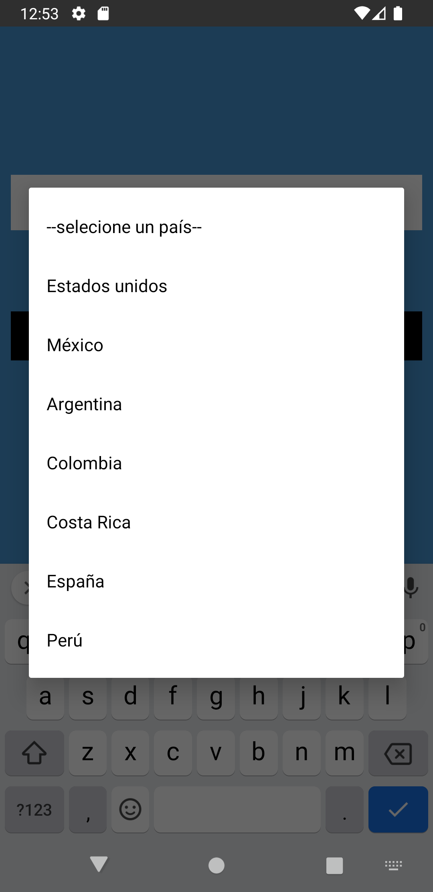
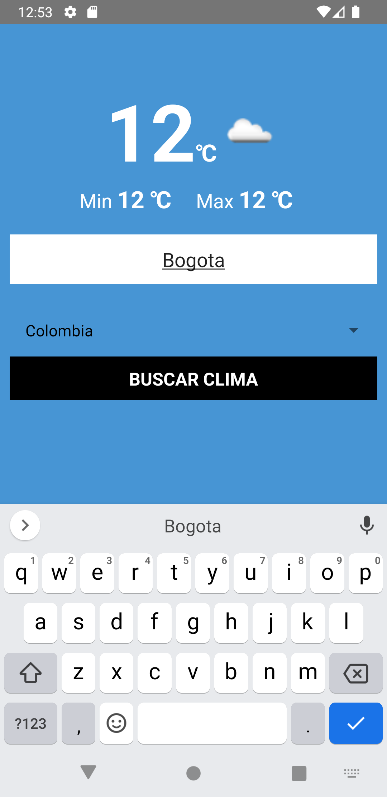
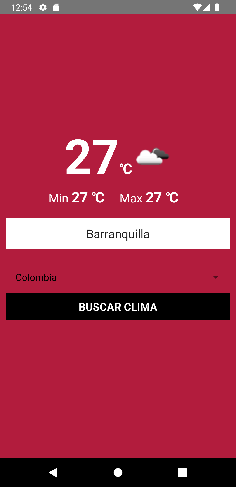
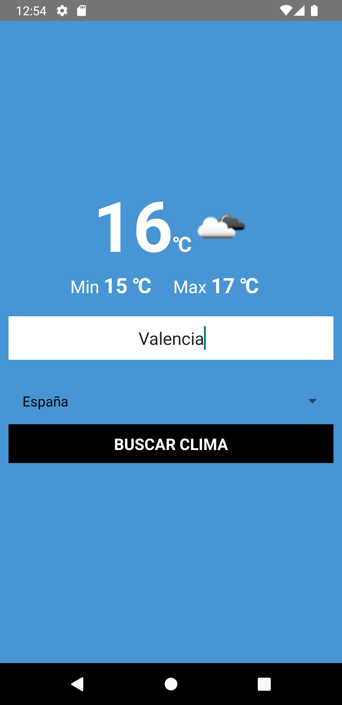
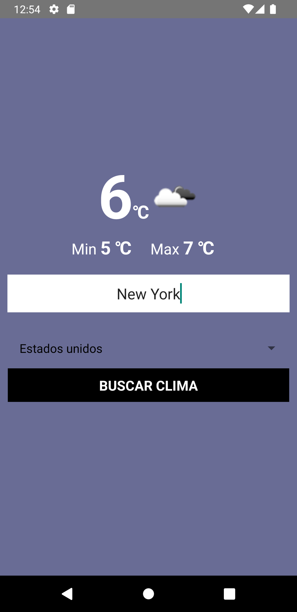

# Weather App  
  APP that consults the weather via API OpenWeather
  
# Libraries

This project has the react-native-picker/picker and axios libraries, before launching the project install them.

**npm i @react-native-picker/picker**
**npm i axios**

# Images

 &nbsp;&nbsp;&nbsp;&nbsp;
 &nbsp;&nbsp;&nbsp;&nbsp; 
 &nbsp;&nbsp;&nbsp;&nbsp;  
 
 
 &nbsp;&nbsp;&nbsp;&nbsp;
 &nbsp;&nbsp;&nbsp;&nbsp;
 
  
# Notes

Inside the APP.js is located a variable called appID that ID is your ID from OpenWeather WebPage
